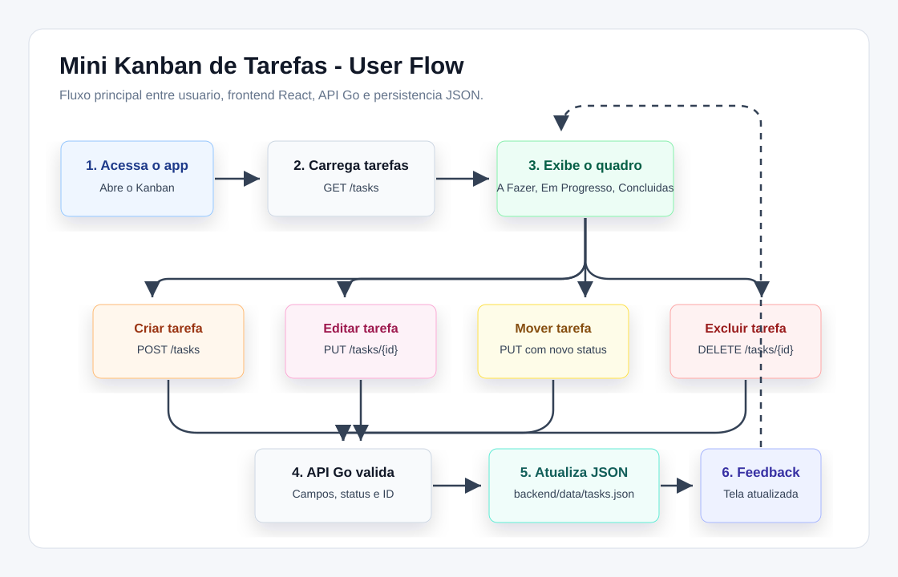

# Desafio Fullstack Veritas

Mini Kanban de tarefas desenvolvido para o desafio pratico da segunda etapa. O projeto usa React no frontend e Go no backend, com uma API REST para criar, listar, editar, mover e excluir tarefas.



## Estrutura

```text
.
├── backend/          # API REST em Go
│   ├── cmd/api/      # Ponto de entrada do servidor
│   ├── data/         # Arquivo JSON usado como persistencia local
│   └── internal/     # Regras, handlers e store de tarefas
├── frontend/         # Interface React com Vite
└── docs/             # Documentacao visual do fluxo de uso
```

## Requisitos

- Go 1.22 ou superior
- Node.js 20 ou superior
- npm

## Como rodar

### Backend

```bash
cd backend
go run ./cmd/api
```

A API fica disponivel em `http://localhost:8080`.

Variaveis opcionais:

- `PORT`: porta do servidor. Padrao: `8080`.
- `TASKS_FILE`: caminho do arquivo JSON de persistencia. Padrao: `data/tasks.json`.

### Frontend

Em outro terminal:

```bash
cd frontend
npm install
npm run dev
```

A aplicacao abre em `http://localhost:5173`.

Se a API estiver em outra URL, crie `frontend/.env.local` com:

```bash
VITE_API_URL=http://localhost:8080
```

## Funcionalidades

- Listagem de tarefas separadas em tres colunas: A Fazer, Em Progresso e Concluidas.
- Criacao de tarefas com titulo, descricao e coluna inicial.
- Edicao de titulo, descricao e status.
- Movimentacao por botoes ou arrastando a tarefa entre colunas.
- Exclusao com confirmacao.
- Feedback visual para sucesso e erro.
- Contadores por coluna.
- Persistencia das tarefas em JSON no backend.

## Endpoints

| Metodo | Rota | Descricao |
| --- | --- | --- |
| `GET` | `/tasks` | Lista todas as tarefas |
| `POST` | `/tasks` | Cria uma nova tarefa |
| `PUT` | `/tasks/{id}` | Atualiza uma tarefa existente |
| `DELETE` | `/tasks/{id}` | Remove uma tarefa |
| `GET` | `/health` | Verifica se a API esta no ar |

Exemplo de payload:

```json
{
  "title": "Revisar README",
  "description": "Conferir instrucoes e user flow",
  "status": "todo"
}
```

Status aceitos:

- `todo`
- `in_progress`
- `done`

## Decisoes tecnicas

- O backend foi feito com a biblioteca padrao do Go para manter a API simples, explicavel e sem dependencia externa.
- A persistencia usa um arquivo JSON porque o escopo permite memoria ou JSON, e o arquivo facilita demonstrar que os dados continuam apos reiniciar a API.
- O store usa `sync.RWMutex` para proteger leitura e escrita das tarefas.
- O frontend usa React com Vite para ter uma estrutura leve e rapida de rodar.
- As atualizacoes de status usam atualizacao otimista no frontend, com rollback caso a API retorne erro.
- O CORS foi configurado no backend para permitir o consumo da API pelo frontend durante o desenvolvimento.

## Validacoes

Backend:

```bash
cd backend
go test ./...
```

Frontend:

```bash
cd frontend
npm run build
npm audit --audit-level=moderate
```

## User Flow

O fluxo principal esta documentado na imagem `docs/user-flow.svg`:

1. Usuario acessa o Kanban.
2. Frontend busca tarefas com `GET /tasks`.
3. Usuario cria, edita, move ou exclui uma tarefa.
4. Frontend envia a acao para a API REST.
5. Backend valida, atualiza o JSON e retorna a resposta.
6. Interface atualiza o quadro e exibe feedback.
